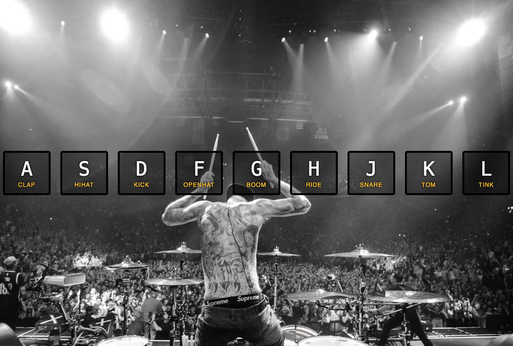

# js-drum-kit

Building a super cool drum kit. 😎
Go to keycode.info for more reference to keyboard codes.

USER YOUR KEYBOARD TO PLAY THE DRUMS! 🥁

    Enjoy =^..^=
 
 The Drum Kit: 
 

The Drum Kit has been clicked!:
 

Great exercise for JS event listeners.

Tks to WesBos for the cool tutorial.

